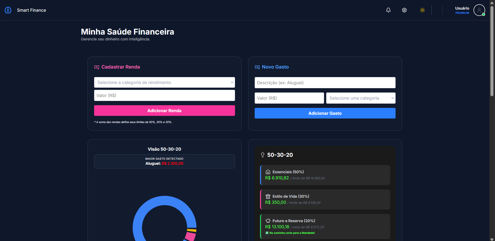
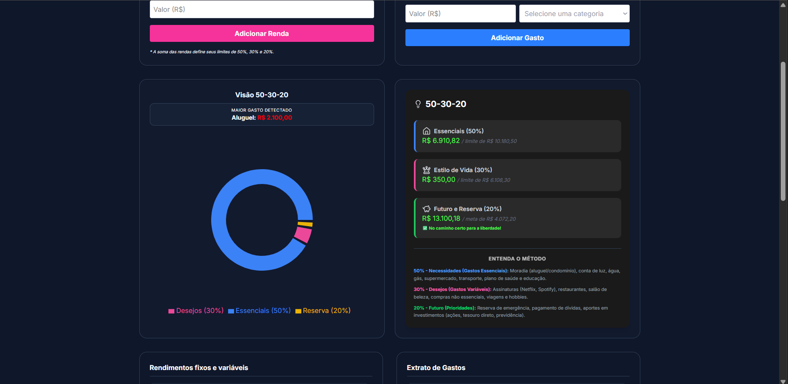
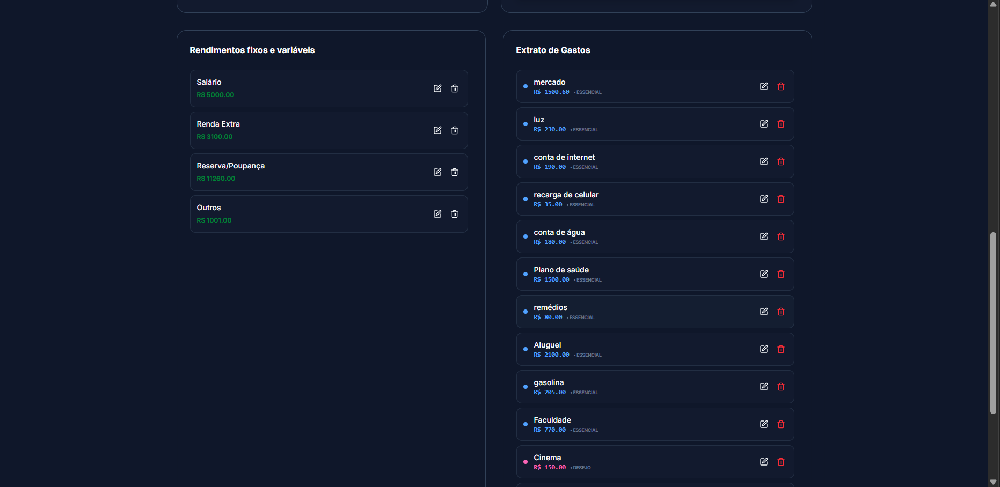

# 💰 Smart finance 50-30-20

**Smart finance** is a personal financial management dashboard that automatically applies the **50-30-20 rule**. Unlike a simple expense list, the system educates users about their financial health by distributing income and expenses into strategic pillars.

## 🚀 Features

- **Income Management:** Register salary and extra income for dynamic budget calculation.
- **Expense Logging:** Register expenses with smart categorization linked to the financial rule.
- **50-30-20 Insights:** A real-time dashboard that monitors whether you are within limits:
    - **50% (Needs):** Housing, health, and food.
    - **30% (Wants):** Leisure, hobbies, and personal desires.
    - **20% (Savings):** Emergency fund and investments.
- **Evolution Chart:** Clear visualization of expense distribution through dynamic donut charts.
- **Smart Statement:** Expense and income lists featuring quick editing capabilities and visual indicators for each pillar.
- **🌍 Internationalization (i18n):** Complete multi-language support (English, Portuguese, and German).
- **💱 Multi-currency Support:** Automatic currency formatting (R$, $, and €) dynamically matching the active interface language.

## 🛠️ Technologies Used

- **React.js** & **TypeScript (TSX)**
- **Vite**
- **Node.js**
- **shadcn/ui** (Radix UI)
- **Tailwind CSS**
- **Lucide React** (Icons)
- **Recharts** (Interactive Data Visualization)
- **i18next** & **react-i18next** (Internationalization Framework)
- **Sonner** (Toast notifications)
- **MockAPI** (Rest API backend simulation)

## 📈 The 50-30-20 Rule

The project was built to reinforce a world-renowned methodology for financial balance:

1. **Needs (50%):** Fundamental expenses for survival and maintenance.
2. **Wants (30%):** Expenses focused on well-being, lifestyle, and leisure.
3. **Savings and Future (20%):** What you set aside for your future self (investments and emergency fund).

## ✨ Key Differentiators

- **Clean Architecture:** Clear separation between UI components, API services, internationalization files, and TypeScript types.
- **Adaptive UX:** Modern interface supporting **Light** and **Dark** themes alongside seamless real-time language and currency switching.
- **Financial Education:** The system does not just list values; it suggests actions based on your current balance.

## 🏗️ Project Architecture

The folder structure was organized to ensure modularity, facilitating code scalability and maintenance:

```text
consumoInteligente/
├── 📂 public/          # Static assets (icons, favicons, etc.)
└── 📂 src/
    ├── 📂 components/  # Reusable UI components and partial logic
    │   ├── 📂 ui/      # Interface components created with shadcn
    │   │   ├── alert-dialog.tsx
    │   │   ├── button.tsx
    │   │   ├── dialog.tsx
    │   │   ├── input.tsx
    │   │   └── label.tsx
    │   ├── Chart.tsx               # Visualization charts (Recharts)
    │   ├── DashboardController.tsx # Parent component orchestrating data states
    │   ├── Footer.tsx
    │   ├── FormGasto.tsx           # New expense registration
    │   ├── FormRendimentos.tsx     # Financial income registration
    │   ├── Insights.tsx            # 50-30-20 analysis panel
    │   ├── ListaGastos.tsx         # Detailed expense history with edit/delete
    │   ├── ListaRendimentos.tsx    # Detailed income sources history
    │   └── Nav.bar.tsx
    ├── 📂 constantes/  # Fixed values (Category configuration)
    │   └── categorias.ts
    ├── 📂 i18n/        # Internationalization configuration & translations
    │   ├── index.ts    # i18next initialization setup
    │   ├── de.json     # German translation dictionary
    │   ├── en.json     # English translation dictionary
    │   └── pt.json     # Portuguese translation dictionary
    ├── 📂 service/     # API integration (Endpoint consumption)
    │   └── consumo.ts
    ├── 📂 tipos/       # TypeScript interface definitions (Types)
    │   └── tipos.ts
    ├── 📂 views/       # Main pages (Full screens)
    │   ├── Dashboard.tsx           # Main management screen
    │   └── LoginPage.tsx           # Authentication screen
    ├── App.tsx         # Root component and layout structure
    ├── main.tsx        # Application entry point
    └── index.css       # Global styles and theme variables
## 🔮 Future Implementations

The project was conceived to be the foundation of a complete financial ecosystem. We plan to expand the platform's capabilities with:

- **🔐 Real Authentication:** Implementing JWT (JSON Web Tokens) for a secure and persistent login system.
- **📅 Short and Long-Term Goals:** A feature to create "objectives" (e.g., Trip, New Car) with a progress bar.
- **📊 Report Exporting:** Generating PDF or Excel files with a monthly summary of expenses and income.
- **🤖 AI Consultant:** An integrated chat that analyzes your expenses and suggests where you can save money to reach the 20% goal faster.
- **🔔 Notifications:** An alert system to warn you when a pillar (e.g., 30% Wants) is close to its limit.

## 💻 How to Run the Project

- Prerequisites: Node.js installed

1. **Clone the repository:**

```bash
git clone https://github.com/Ada-Finance/Consumo-Inteligente.git
```

2. **Install the dependencies:**

```bash
npm install
```

3. **Libraries used:**

```bash
npm install sonner
npm install recharts
npx shadcn@latest init
npm install i18next react-i18next
```

4. **Run the project:**

```bash
npm run dev
```

## 👩‍💻 Developers

This project was developed with dedication during a Hackathon at the end of a Front-end course at **AdaTech** by:

- Vivian Santana [GitHub](https://github.com) | [LinkedIn](https://linkedin.com)
- Jacqueline Mattisen [GitHub](https://github.com) | [LinkedIn](https://linkedin.com)
---
###

| | | |
|---|---|---|
|  |  | |

